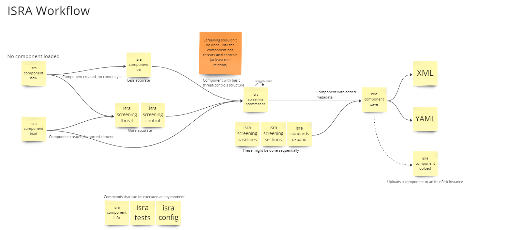

# ISRA (IriusRisk Security Research Assistant)

## Overview

ISRA, the IriusRisk Security Research Assistant, is a Command Line Interface (CLI) utility developed by the Security Research Team at IriusRisk designed to assist in the creation of threat model components following a "content-as-code" approach. 

Additionally, it helps the user to add and review metadata that could provide more value to the component when deployed in a threat modeling application

## Capabilities of ISRA

ISRA offers a suite of commands tailored to facilitate various security operations:

* **About**: Provides version information and a general overview of the utility
* **Component**: Manages threat modeling components, supporting creation, modification, and IriusRisk integration
* **Config**: Allows for the configuration of ISRA settings, including property listing and configuration persistence
* **Screening**: Automates the process of adding Mitre ATT&CK technique references, setting countermeasures baselines, and other metadata generation based on the component threat model
* **Standards**: Assists in mapping countermeasures to compliance standards to ensure adherence to industry best practices. It relies on OpenCRE to add additional standards automatically
* **Tests**: Provides a test suite to execute automated tests on YAML components

## How to install

    pip install path/to/isra-<version>.whl

or

    git clone git@github.com:iriusrisk/iriusrisk-security-research-assistant.git
    cd iriusrisk-security-research-assistant
    pip install .

If the installation was successful the following command should work:

    isra

Now, the first thing to do is to configure the OpenAI API key so that ChatGPT functionalities can work. It's up to you and your system to set the environment variable. E.g.:

    export OPENAI_API_KEY=<api-key>

After that, run the following:

    isra config info
    isra config update
    <select gpt_model>
    <select gpt model to use>
    isra config list

## Usage Instructions
ISRA can be invoked through the command line with specific parameters and options for each available command:

### Information about the application:

`isra about`

This command displays the current version of ISRA.

### Component Creation:

`isra component new`

This command registers a new security component within the system.

### Human-in-the-loop Screening:

`isra screening <topic>`

This command performs an automated screening to identify potential metadata for the current component.

### Further Assistance
For detailed explanations of all commands, including options and parameters, use the help command:

`isra <command> --help`

This will provide a guide through the various functionalities ISRA offers.

For comprehensive documentation on usage, please refer to the DOCS.md file that accompanies ISRA distribution. It contains in-depth details on each command and its proper syntax for advanced use cases.

## Expected workflow

### Usage example

Use case: the user wants to create a component that will be shown in a threat model diagram. This component will have threats and countermeasures. With ISRA the user can build this component by following these steps:

    isra component new          # Creates a new component
    isra component tm           # Produces some threats and countermeasures
    isra screening stride       # Sets a STRIDE category for each threat
    isra screening cwe          # Sets the best CWE weakness for each countermeasure
    isra screening baselines    # Finds the best baseline standard (ISO27001, NIST 800-53, ASVS4)
    isra screening sections     # Finds the best section from the baseline standard
    isra standards expand       # Adds more standards, relies on OpenCRE
    isra component save --format yaml # Saves the file in a YAML format

The output of the entire process will be a YSC component: a component represented in YAML format that can be used to work collaboratively.

After that, the component can be loaded from file and uploaded to IriusRisk if needed:

    isra component load                         # Select component to load from file
    isra component load --file /path/to/file    # Select component to load from specific path
    isra component upload                       # Uploads the component to IriusRisk
    isra component pull                         # Downloads the component from IriusRisk

## Note about allowed taxonomies

Components created with ISRA are generated in a format we called YSC (YAML Structured Components) which is a way to decouple from the existing IriusRisk XML format. 
This format is easier to modify and it can handle many different types of data.
However, IriusRisk won't understand any value defined by the user but rather those that belong to a list of allowed values.
ISRA tries to warn the user about these values when loading a component but it doesn't provide a functionality to set these values automatically yet.

If you have doubts about which values are allowed you can take a look at the following 